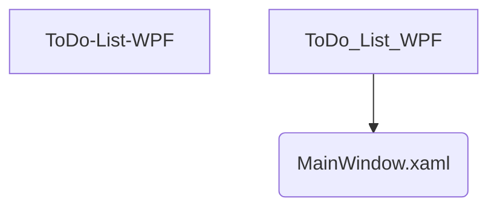

# ToDo List WPF

## Overview
**ToDo List WPF** is a **Medium** difficulty project implemented in **C#**.

## 📂 Project Structure
The following directory structure visualizes the file organization of this project.

```text
ToDo-List-WPF
└── MainWindow.xaml

```

## 📐 Components
Visual representation of the primary files in this project:



## Features
- Implements core logic for ToDo List WPF.
- Structured for scalability and readability.
- Demonstrates **C#** best practices for **Medium** complexity.

## How to Run
1. Navigate to the project directory:
   ```bash
   cd ToDo-List-WPF
   ```
2. Check the source code for entry points (e.g., `main` run command).
