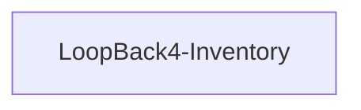

# LoopBack4 Inventory

## Overview
**LoopBack4 Inventory** is a **Hard** difficulty project implemented in **Node.js**.

## 📂 Project Structure
The following directory structure visualizes the file organization of this project.

```text
LoopBack4-Inventory
└── src
    └── models

```

## 📐 Components
Visual representation of the primary files in this project:



## Features
- Implements core logic for LoopBack4 Inventory.
- Structured for scalability and readability.
- Demonstrates **Node.js** best practices for **Hard** complexity.

## How to Run
1. Navigate to the project directory:
   ```bash
   cd LoopBack4-Inventory
   ```
2. Check the source code for entry points (e.g., `main` run command).
